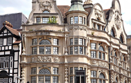
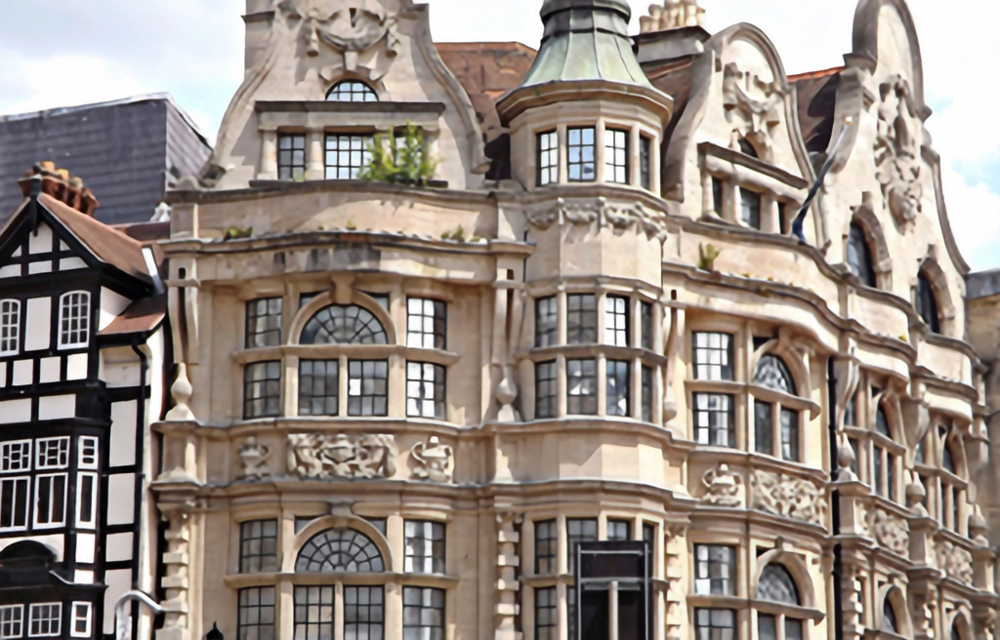
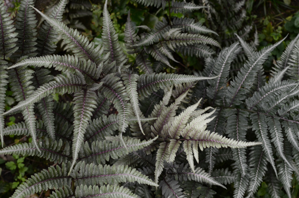
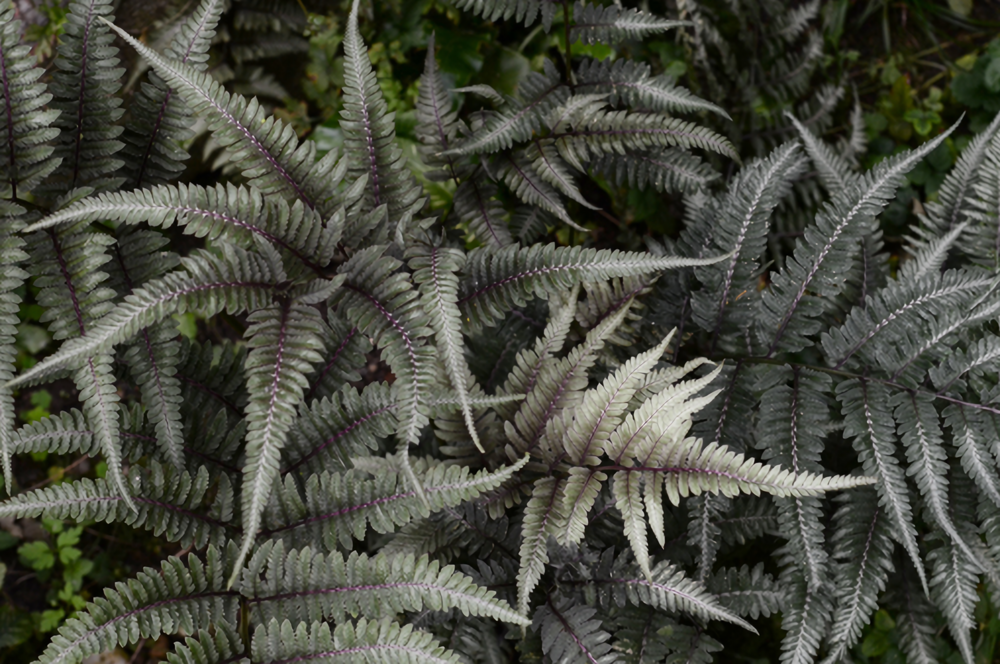

# Synthesize Super Resolution Image by Experts Mining

## Introduction

  We build a module that synthesizes super-resolution images by 4x upscaling. While preparing, we utilized the pretrained model [SeemoRe](https://arxiv.org/abs/2402.03412) provided in [HuggingFace](https://huggingface.co/eduardzamfir/SeemoRe-T/tree/main).

## Setting Up the Environment

### Using Conda (recommended)

1. Install [Conda](https://conda.io/projects/conda/en/latest/user-guide/install/index.html), if not already installed.
2. Clone the repository:
    ~~~
    git clone https://github.com/byrkbrk/synthesizing-super-resolution-by-experts.git
    ~~~
3. Change the directory:
    ~~~
    cd synthesizing-super-resolution-by-experts
    ~~~
4. Create the environment:
    ~~~
    conda env create -f synthesizing-sr-by-experts.yaml
    ~~~
5. Activate the environment:
    ~~~
    conda activate synthesizing-sr-by-experts
    ~~~

### Using Pip

## Synthesizing SR Image

### Example usages
~~~
python3 synthesize.py building.png
~~~

~~~
python3 synthesize.py plant.png
~~~

  
  

  
  

## Synthesizing by using Gradio
